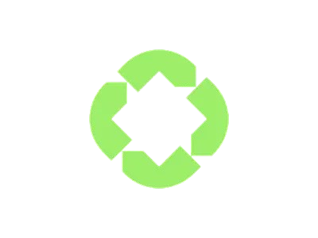

🌍 EcoCollect — Smart & Sustainable Waste Management Platform

   

🌱 About EcoCollect

EcoCollect is a modern, technology-driven waste management platform designed to promote a credit-based circular economy.
It connects households, waste collectors, and recycling businesses to make waste disposal profitable, efficient, and environmentally responsible.

The platform focuses on smart waste collection, AI-based waste recognition, sustainable e-commerce, and community engagement, with a strong mission to build a cleaner and greener future.

📍 Target Region: West Bengal, India

🎯 Vision

To transform waste into valuable resources by empowering communities through smart technology and sustainable practices.

✨ Key Features
🔄 Waste-to-Credit System

Upload waste images for smart categorization

AI-powered waste type recognition

Earn credits based on waste type, quality & quantity

Doorstep pickup scheduling

🛍 Sustainable Marketplace

Eco-friendly product marketplace

Redeem earned credits for purchases

Support recycled & upcycled products

Secure online transactions

🚚 Smart Pickup Services

Normal & urgent pickup options

Real-time pickup tracking

Optimized routes for collectors

Emergency waste pickup support

👥 Community & Awareness

Environmental blogs & stories

Community discussions

Sustainability education

Achievement badges & engagement rewards

📊 Analytics Dashboard

Track environmental impact

Credit & transaction history

Waste generation insights

Performance analytics for collectors & businesses

🛠 Tech Stack
Frontend

React (Vite)

Tailwind CSS

Redux Toolkit

React Router DOM

Chart.js

Framer Motion & GSAP

Axios

Backend

Node.js & Express

MongoDB & Mongoose

JWT Authentication

bcrypt

Cloudinary

Nodemailer

Google Generative AI

Validator.js

Tools & Utilities

Vite

ESLint

npm

dotenv

node-schedule

🗂 Project Structure
EcoCollect/
├── Backend/
│   └── src/
│       ├── controllers/
│       ├── models/
│       ├── routes/
│       ├── middleware/
│       ├── config/
│       ├── utils/
│       └── mail/
│
├── frontend/
│   └── src/
│       ├── components/
│       ├── pages/
│       ├── services/
│       ├── slices/
│       └── utils/
│
└── README.md

🚀 Getting Started
Prerequisites

Node.js (v16+)

MongoDB

npm / yarn

Installation
1️⃣ Clone Repository
git clone https://github.com/karakRohan/EnviroMat-main.git
cd EnviroMat

2️⃣ Backend Setup
cd Backend
npm install
cp .env.example .env
npm start

3️⃣ Frontend Setup
cd frontend
npm install
npm run dev

📌 Frontend: http://localhost:5173
📌 Backend API: http://localhost:4000

🔐 Environment Variables
MONGODB_URI=
JWT_SECRET=
REFRESH_TOKEN_SECRET=

CLOUDINARY_CLOUD_NAME=
CLOUDINARY_API_KEY=
CLOUDINARY_API_SECRET=

MAIL_HOST=
MAIL_USER=
MAIL_PASS=

GOOGLE_AI_API_KEY=

PORT=4000
NODE_ENV=development

👥 User Roles
🏠 Households

Upload waste

Schedule pickups

Earn & redeem credits

Track impact

🚛 Waste Collectors

Accept pickup requests

Optimize routes

Track earnings

Emergency handling

🏭 Recycling Businesses

Buy collected materials

Inventory management

Analytics & reporting

🔌 API Overview
Authentication

POST /api/auth/register

POST /api/auth/login

POST /api/auth/verify-email

POST /api/auth/forgot-password

Waste Services

POST /api/waste/upload

POST /api/waste/pickup-request

GET /api/waste/history

Credits & Orders

GET /api/credits/balance

POST /api/credits/transfer

POST /api/orders/create

🤝 Contributing

Contributions are welcome 💚

Fork the repository

Create a new branch

Commit your changes

Push and open a Pull Request

🐞 Issues & Feature Requests

Report issues via
👉 GitHub Issues

📄 License

Licensed under the MIT License.

📬 Contact

Email: support@ecocollect.com

GitHub: @karakRohan

🌱 EcoCollect

Turning waste into value for a sustainable tomorrow

Made with ❤️ for a greener future 🌍

